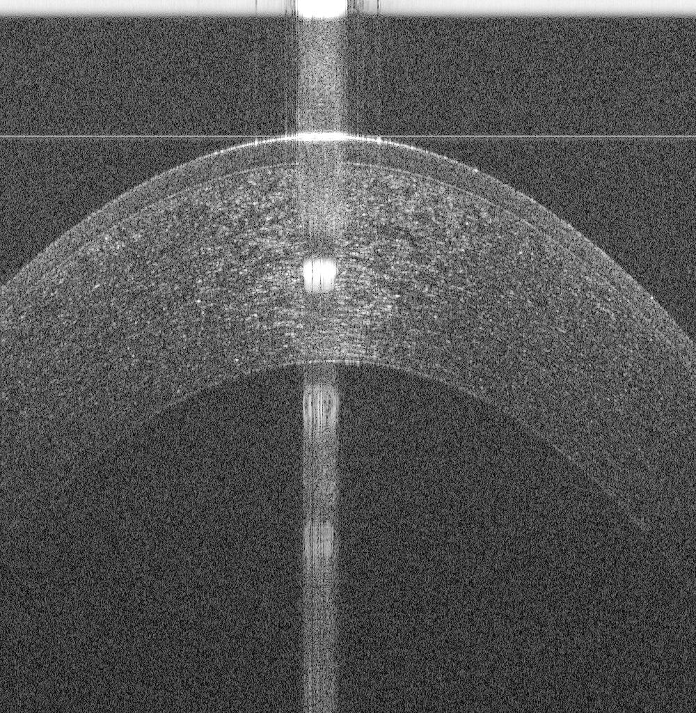
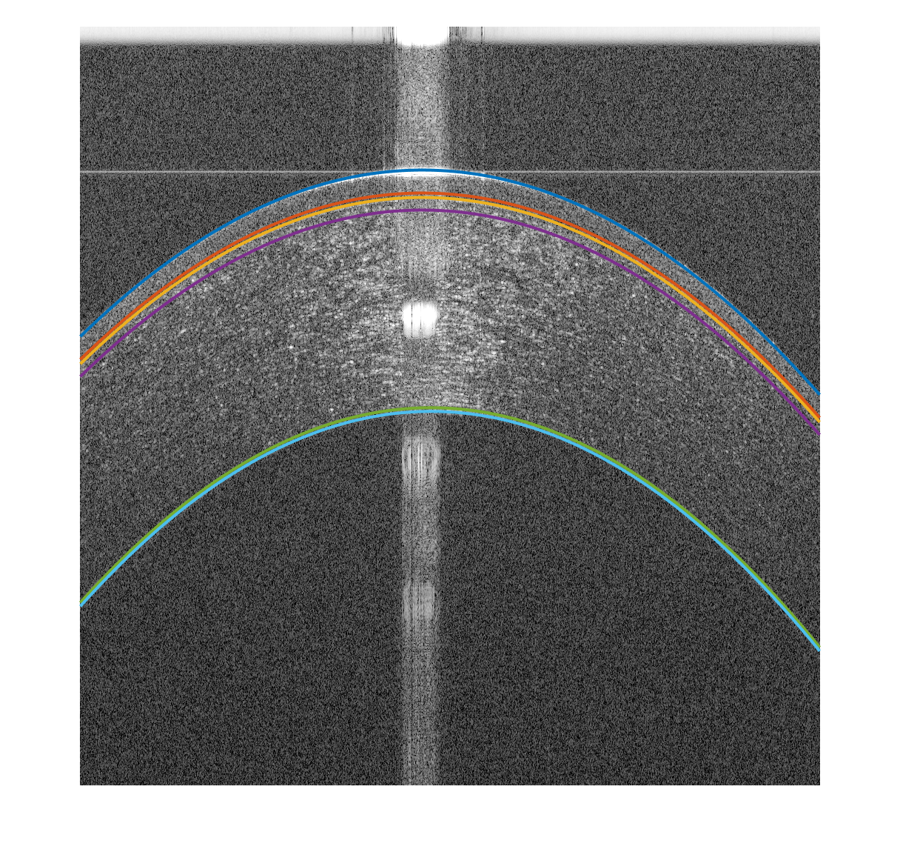

# README

This repository contains sample Matlab code for the segmentation of corneal layer interfaces using random sample consensus (RANSAC) method with polynomial models. This code is intended to be a fast way to segment corneal optical coherence tomography (OCT) images with high SNR, e.g., the OCT image shown in the following figure.

An example of the segmented OCT image is shown in the following figure.

The algorithm behind this code is published in the following paper:

[Automatic Segmentation of Corneal Microlayers on Optical Coherence Tomography Images](https://tvst.arvojournals.org/article.aspx?articleid=2735971)

The paper is open access, so please read the paper for more details.

Please, cite the paper if you used the code by using the following citation:

Amr Elsawy, Mohamed Abdel-Mottaleb, Ibrahim-Osama Sayed, Dan Wen, Vatookarn Roongpoovapatr, Taher Eleiwa, Ahmed M. Sayed, Mariam Raheem, Gustavo Gameiro, Mohamed Abou Shousha; Automatic Segmentation of Corneal Microlayers on Optical Coherence Tomography Images. Trans. Vis. Sci. Tech. 2019;8(3):39. doi: https://doi.org/10.1167/tvst.8.3.39.

Note that the provided OCT image is obtained from me, Amr Elsawy, using Bioptegen OCT machine.